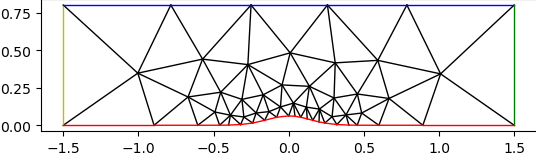

# Discontinous-Galerkin solver for Euler equations

## Case 
The case corresponds to , and it's solved on a unstructured mesh using Discontinous-Galerkin finite-element method, solving the Euler equations.

## Solver

- The code can run polynomial orders $p=0,1,2$ using Lagrange basis.
- RK4 is used to march the solution with a local time stepping.
- The armadillo package must be installed in order to compute some matrix operations (inverse of the mass matrix)

1. `DG.h` defines all the functions used by the solver and the constants for the flow. 
2. `flux_BC.cpp` includes the flux (Fx,Fy,and Roe) and the boundary conditions 
3. `quad.cpp` includes the basis functions, 1d/2d quad points, Jacobian calculations, Mass Matrix for curved elements
4. `readgrid.cpp` is the function used to read the curved mesh. It just works for this particular case.
5. `residuals.cpp` includes 4 functions to compute the interior and edge residual contributions.
6. `solver.cpp` puts everything together and runs the time marching scheme RK4
7. `main.cpp` call the solver and there you can set the mesh, p, tolerance, and CFL

## Bump mesh generation

Files to generate the meshes in `gen_mesh` 

1. `generate_mesh.m` : get the nodes and triangle points for the first unstructured mesh. This uses the distmesh package by Per-Olof Persson. Elements are clusters around the bump.
2. `gri_file.py` : generate .gri file. Containing nodes, triangles, and boundaries information.
3. `process_grid.py` : Process the .gri file and generates the (text files)matrices:
    - I2E: mapping from interior faces to elements. Contains 4 integers `elemL`, `faceL`, `elemR`, `faceR`. Containing the elements adjacent to the face and the local numbering of their corresponding face. The left (L) element is arbitrarily chosen as the one with the lower element index.
    - B2E: Mapping from boundary faces to elements and boundary group. Contains three integers `elem`, `face`, `bgroup`.
    - In: Normal vectors for interior faces.
    - Bn: Normal vector for boundary faces.
    - Area: Area of each element.
  The matrices are all 1-based. This file also does a sanity check:
    $$\sum\limits_{i=1}^3 l_i\vec{n}_{i,out}=0$$
4. `refine.py` : File to do uniform mesh refinement, where element is split into four subelements by means of edge bisection. This generates a new set of elements of nodes that can be processed with `gri_file.m` and `process_grid.py`.

The meshes are finally curved and the codes are in `curve_mesh`:

1. `convert.py`: Creates elements of order $q=3$ by obtaining the high-order nodes from a uniformly-refined mesh.
2. `process_grid.py`: Same as before but add an extra list with the high order elements at the bottom.

Only the elements at the bottom of the domain are curved, the rest are kept linear. 

![]{./curve_mesh/curved_and_linear_elements.png}

## Some details

- The `Area` file does not take into account the high order representation of the elements at the bottom. But this quantity is only used to compute the local `dt` to march the solution.
- The flag `free-stream` is to run a test running free-stream on all boundaries.
